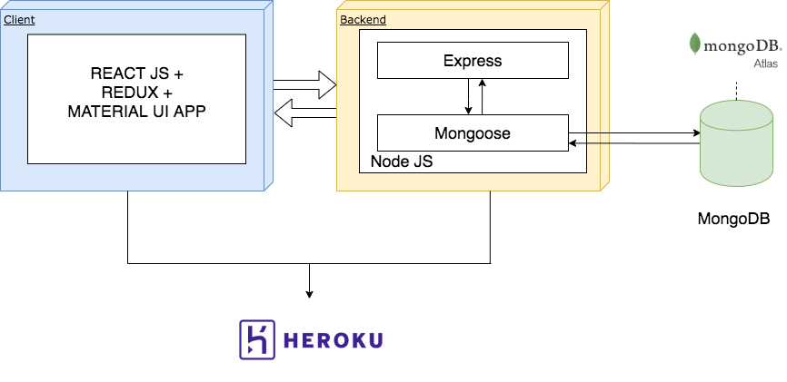
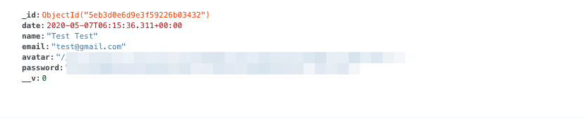

# No-food-waste (Metro)

Full stack application dashboard for a retailer company with data visualisations in order to raise awareness of employees on such a subjects as sustanability and food waste.

## Deployed (WIP)

https://guarded-ravine-01897.herokuapp.com/

---

Created by: Irina Baeva.

---

## Technologies:

- Frontend: React + Redux + Material UI
- Backend: NodeJS, Express, JWT Authentication
- DataBase: MongoDB



---

## Features

- registration with email and password,
- login, logout with JWT,
- check local and global statistics

## Installation

Clone the project

```sh
git clone https://github.com/irina-baeva/no-food-waste-project.git
```

Install all required packages

```sh
npm install
```

```sh
cd ./client
```

```sh
npm install
```

You might want to look into config/production.json to set up your jwt secret word and MAPBOX TOKEN.

#### Running the project

Runs the app in the development mode and open http://localhost:3000 to view it in the browser.

```sh
npm run dev
```

Builds the app for production to the build folder

```sh
npm run build
```

#### Documentation for API

Check endpoints of API with Postman

##### Register account

##### Local endpoint:

Post request with empty body:

```sh
http://localhost:5050/api/users
```

We get Errors:

```sh
{
    "errors": [
        {
            "msg": "Name is required",
            "param": "name",
            "location": "body"
        },
        {
            "msg": "Include valid email",
            "param": "email",
            "location": "body"
        },
        {
            "msg": "Please, enter a password with 6 or more characters",
            "param": "password",
            "location": "body"
        }
    ]
}
```

Post request with user who already registered with request body as following:

```sh
{
	"name": "Irina",
	"email": "irinabayova@gmail.com",
	"password": "**********"
}
```

We get Errors as a response:

```sh
{
    "errors": [
        {
            "msg": "User already exists"
        }
    ]
}
```

The following is an example of a valid request body for the Register Account:

```sh
{
	"name": "Test Test",
	"email": "test@gmail.com",
	"password": "******"
}
```

As a success response we get JWT token:

```sh
{
    "token": "********************************.******************.**********************"
}
```

And new test user appeared in Mongodb Atlas collections:

